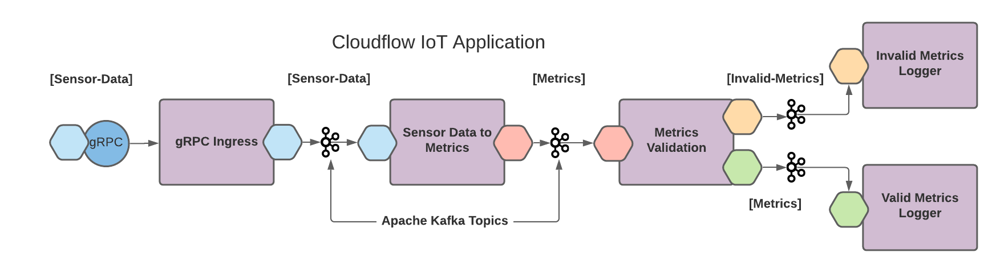
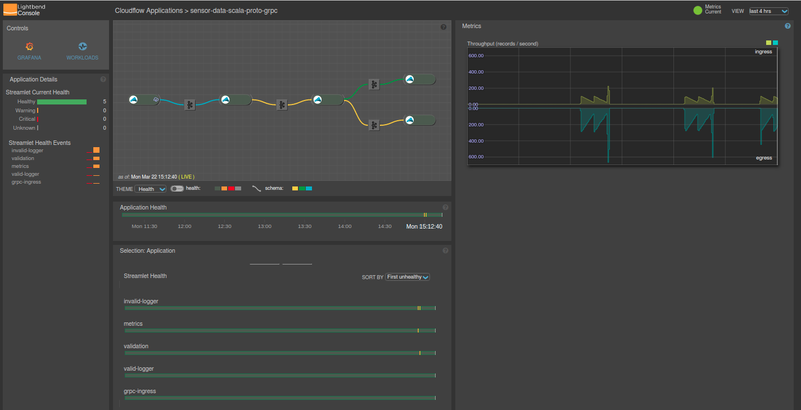

# Akka Data Pipelines - Streaming Data Pipelines Simplified - Blog Intro

For me, streaming data in motion is much more interesting than data at rest.

Whether you’re building an Internet of Things (IoT) to collect metrics from sensors or devices,  digital twins to monitor power equipment or connected cars, or feeding data to a machine learning algorithm, Akka Data Pipelines is your friend.

Building data pipelines to move data from one source to another, in a streaming fashion—so it can be stored, used for analytics, or combined with other data--can get to be quite complicated.

By leveraging Akka Data Pipelines from Lightbend, you can accelerate development and decrease risks. To illustrate how we can help you build streaming systems faster and easier, we’ve created the Akka Data Pipelines Tutorial that covers the following topics:

- What is Akka Data Pipelines, and why you should care
- Setting up a local Kubernetes test environment using Microk8s
- Installing Akka Data Pipelines
- Testing and running a sample working windmill sensor data application
- Monitoring the IoT PoC with Lightbend Telemetry and Console
- Finally, we walk you through the code base of the sample application

You can find the Akka Data Pipelines Tutorial [here](https://developer.lightbend.com/guides/akka-data-pipelines-iot-sensors-tutorial).

---
# Notes:

## grpcurl
https://github.com/fullstorydev/grpcurl

## Listing Services
grpcurl -plaintext localhost:3000 list

SensorDataService
grpc.reflection.v1alpha.ServerReflection

## Describing Elements
grpcurl -plaintext localhost:3000 describe SensorDataService
SensorDataService is a service:
service SensorDataService {
rpc Provide ( .SensorData ) returns ( .SensorDataReply );
rpc ProvideStreamed ( stream .SensorData ) returns ( stream .SensorDataReply );
}

## Invoking Service
grpcurl -plaintext -d '{"deviceId":"c75cb448-df0e-4692-8e06-0321b7703992","timestamp":1495545646279,"measurements":{"power":1.7,"rotorSpeed":3.9,"windSpeed":105.9}}' \
localhost:3000 SensorDataService/Provide
{
"deviceId": "c75cb448-df0e-4692-8e06-0321b7703992",
"success": true
}

## Invoking through Traefik Ingress on Microk8s (localhost:8080)
grpcurl -plaintext -d '{"deviceId":"c75cb448-df0e-4692-8e06-0321b7703992","timestamp":1495545646279,"measurements":{"power":1.7,"rotorSpeed":3.9,"windSpeed":105.9}}' \
localhost:8080 SensorDataService/Provide

## invalid
grpcurl -plaintext -d '{"deviceId":"c75cb448-df0e-4692-8e06-0321b7703992","timestamp":1495545646279,"measurements":{"power":1.7,"rotorSpeed":-3.9,"windSpeed":105.9}}' \
localhost:8080 SensorDataService/Provide

grpcurl -plaintext -d '{"deviceId":"dev1","timestamp":1495545646279,"measurements":
{"power":-1.7,"rotorSpeed":3.9,"windSpeed":105.9}}' \
localhost:3000 SensorDataService/Provide